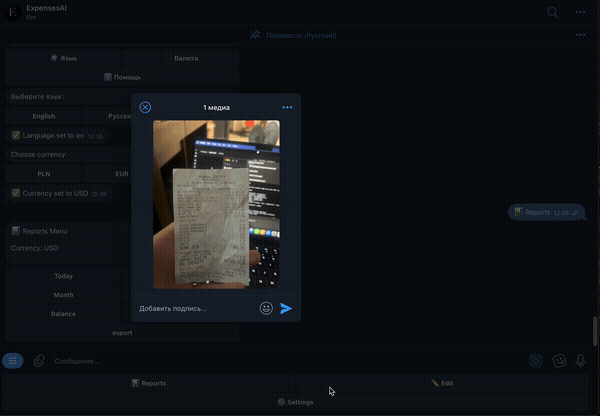

# ExpensesAI


AI-powered Telegram finance assistant: send a receipt photo — it extracts the expenses, tracks your income and spending, and answers questions about your money in plain language.

**Try it** [@checkexpenses_ai_bot](https://t.me/checkexpenses_ai_bot)



## Features

- 📸 Receipt recognition via OpenAI Vision (Structured Outputs / JSON Schema)
- 💸 Expense & income tracking
- 🤖 AI financial assistant — ask questions like:

```
How much did I spend this month?
What is my biggest spending category?
Сколько я потратил на транспорт?
Ile wydałem na jedzenie?
```

- 📊 Reports & spending analytics
- 🌍 English / Русский / Polski

## How it works

```
Receipt photo → OpenAI Vision → structured JSON → validation → PostgreSQL
/ask question → context from DB → LLM → answer
```

Layered backend: aiogram handlers → services → repositories → SQLAlchemy 2.0 → PostgreSQL. Migrations via Alembic.

## Tech Stack

| Category | Technologies |
|----------|--------------|
| Backend  | Python 3.13, aiogram, SQLAlchemy 2.0 |
| Database | PostgreSQL 16, Alembic |
| AI       | OpenAI Vision, Structured Outputs |
| DevOps   | Docker, GitHub Actions, Ubuntu VPS |
| Quality  | Ruff, pytest, pre-commit |

## Quick Start

```bash
git clone https://github.com/rory1337-prog/expense-ai-tg-bot.git
cd expense-ai-tg-bot
cp .env.example .env   # fill in the variables below
docker compose up --build
```

| Variable | Description |
|----------|-------------|
| `BOT_TOKEN` | Telegram bot token from [@BotFather](https://t.me/BotFather) |
| `OPENAI_API_KEY` | OpenAI API key |
| `DATABASE_URL` | PostgreSQL connection string |

<details>
<summary>Run without Docker</summary>

Requires a running PostgreSQL instance.

```bash
pip install -r requirements.txt -r requirements-dev.txt
alembic upgrade head
python bot.py
```

</details>

## Development

```bash
ruff check .
black --check .
pytest
```

## Roadmap

- [x] AI receipt OCR, PostgreSQL + SQLAlchemy, Alembic, Docker, CI
- [ ] Budget planning & spending recommendations
- [ ] REST API
- [ ] Web dashboard

## License

[MIT](LICENSE)